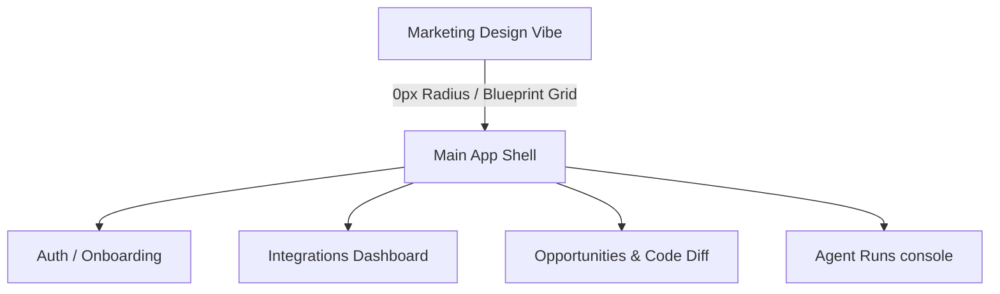

# Origin Visual Design System & Migration Blueprint

This document acts as the single source of truth for the Origin design language. It is extracted directly from the actual implemented components, layouts, typography, and styles in the marketing codebase. It details the exact specifications, tokens, and visual principles of the Origin marketing site and defines the **Main App Migration Rules** for building a high-density, cohesive product dashboard.

---

## 1. Core Visual Philosophy
The Origin visual brand is characterized by an **engineering-led, neo-brutalist technical aesthetic**. It blends the clean precision of developer tools (monospaced typefaces, interactive matrix grids, terminal logs) with premium, light-sand minimalism.

Key aesthetic principles include:
- **Strict Structural Rectilinearism**: A complete reliance on sharp `0px` borders, creating a blueprint-like grid structure.
- **Selective High-Contrast Accents**: Solid monochrome bases with surgical application of a single, vibrant engineering orange for status, interactive focus, and process state.
- **Ambient Canvas Depth**: Subtle background dot grids and column guidelines that evoke CAD sheets or blueprint canvases.
- **Data-Dense Technical Layouts**: Clear separation of metrics, logs, and workflow panels imitating professional IDEs and diagnostic terminals.

---

## 2. Color Palette & Tokens

The site utilizes a curated palette built around light-sand canvas colors, charcoal-zinc elements, and a high-visibility orange accent.

### A. Primary Palette
| Token Name | Hex Value | Implemented CSS Variable / Tailwind Class | Intended Use / Notes |
| :--- | :--- | :--- | :--- |
| **Sand Canvas** | `#F5F5F4` | `background-color: #F5F5F4 !important` | The global background of the html/body. Evokes natural paper or raw card stock. |
| **Pure White** | `#ffffff` | `bg-white`, `bg-[#ffffff]` | Used for dashboard frames, cards, buttons, and content panels to stand out against the sand background. |
| **Premium Dark** | `#0a0a0a` | `--foreground: #0a0a0a`, `text-black` | Main typography color and primary elements. Extremely dark zinc, softer than absolute black `#000000`. |
| **Hero Dark** | `#111111` | `bg-[#111111]`, `border-[#111111]` | Used for solid monochrome elements like primary buttons. |
| **Engineering Orange** | `#e8662a` | `bg-[#e8662a]`, `text-[#e8662a]` | The singular branding color. Used for active status pills, progress bars, active indicators, and interactive dots. |

### B. Background Opacity Map
Subtle layers are generated using percentages of black over white backgrounds:
- **Sidebar Background**: `bg-[#F5F5F4]` (nested within the white board wrapper).
- **Muted Panel Background**: `bg-black/[0.015]`, `bg-[rgba(0,0,0,0.005)]` (used for terminal consoles, secondary badges).
- **Glassmorphism Backdrop**: `bg-[#ffffff]/60 backdrop-blur-md` (used in [signal-architecture.tsx](file:///Users/aparupganguly/developer/origin-marketing-site/components/signal-architecture.tsx)).

### C. Text Colors & Opacity Hierarchy
Typography scale leverages opacity layers for visual priority:
- **Primary / Active Header**: `text-black` or `text-black/85` (`rgba(0,0,0,0.85)`).
- **Standard Body / Labels**: `text-black/75` (`rgba(0,0,0,0.75)`).
- **Secondary Body / Explanations**: `text-black/50` or `text-black/60` (`rgba(0,0,0,0.50)`).
- **Muted Meta / Footnotes**: `text-black/35` (`rgba(0,0,0,0.35)`).
- **Unfocused / Terminals**: `text-black/25` (`rgba(0,0,0,0.25)`).
- **Warnings / Alert Tags**: `text-[#e8662a]/90` (lowered opacity orange for text readability).
- **Success States**: `text-emerald-600` (used in diff views and optimization logs).

### D. Border Colors
Borders are kept extremely thin and low-contrast to prevent layout noise:
- **Global Panel Border**: `border-black/[0.05]` or `border-black/[0.04]` (very light charcoal line).
- **Layout Grid Lines**: `rgba(0,0,0,0.02)` or `rgba(0,0,0,0.03)` (almost invisible column dividers).
- **Accent Hover Border**: `hover:border-[#e8662a]/20` (soft orange highlights on cursor hover).
- **Secondary Divides**: `divide-black/[0.03]` or `border-black/[0.03]`.

---

## 3. Typography System

The typography configuration utilizes three distinct font families with rigid weight and sizing constraints.

### A. Font Families
1. **Geometric Serif/Display**: `Schibsted Grotesk` (`var(--font-schibsted-grotesk)`). Used for main headers, section subtitles, and prominent labels. Contemporary, sharp geometry.
2. **Technical Sans-Serif**: `Geist` (`var(--font-geist-sans)`). Used for body content, card descriptions, navigation items, and button labels. High readability.
3. **Monospace / Terminal**: `Geist Mono` (`var(--font-geist-mono)`). Used for metadata, step numbers, warning logs, code diffs, and prompt boxes.

### B. Font Weights
- **Regular**: `font-normal` (400) - Standard headers and body paragraphs.
- **Medium**: `font-medium` (500) - Navigation links, primary button actions.
- **Semi-Bold / Bold**: `font-semibold` (600) / `font-bold` (700) - Technical labels, card headlines, system log states.

### C. Size Scales & Typography Tokens
- **Hero Title**: `text-[24px] sm:text-[36px] md:text-[48px] lg:text-[62px]`
  - Line height: `1.12`
  - Letter spacing: `-0.05em`
  - Weight: `font-normal`
  - Font: `Schibsted Grotesk`
- **Section Headers**: `text-3xl sm:text-[42px]`
  - Line height: `1.1`
  - Letter spacing: `-0.025em`
  - Weight: `font-normal`
  - Font: `Schibsted Grotesk`
- **Card Title / Action Labels**: `text-[16px]` or `text-[14px]`
  - Weight: `font-semibold` / `font-bold`
  - Font: `Schibsted Grotesk` or `Geist Sans`
- **Body Text (Large / Intro)**: `text-[13px] sm:text-[16px] md:text-[18px]`
  - Line height: `leading-relaxed`
  - Color: `rgba(0,0,0,0.50)`
- **Body Text (Standard / Card Description)**: `text-[13px]` or `text-[14px]`
  - Line height: `leading-relaxed` or `leading-normal`
- **Small Details / Meta Labels**: `text-[11px]`
  - Weight: `font-mono` or `font-sans`
- **Technical Badges / Terminal Logs**: `text-[9px]` or `text-[8px]`
  - Weight: `font-bold`
  - Font: `Geist Mono`
  - Letter spacing: `tracking-wider` or `tracking-[0.12em]` / `tracking-[0.08em]`

---

## 4. Geometry & Layout Patterns

### A. Border Radius
- **Strictly `0px` (`borderRadius: '0px'`, `rounded-none`)** on every element:
  - Outer mockup container
  - Accordion dropdown wraps
  - Primary and secondary buttons
  - Badges and status indicators
  - Card modules
  - Inner terminal logs

### B. Border Widths
- Standard borders are `1px` wide.
- Border accents (e.g. left side win/loss indicators) are `2px` wide:
  - Win Indicator: `border-left: 2px solid var(--foreground)`
  - Loss Indicator: `border-left: 2px solid color-mix(in srgb, var(--foreground) 10%, transparent)`

### C. Shadows
Instead of heavy blur shadows, the system uses tight, low-opacity drop shadows:
- **Card Mockup Frame**: `shadow-[0_24px_64px_rgba(0,0,0,0.06),0_0_1px_rgba(0,0,0,0.05)]`
- **Premium Lift**: `shadow-premium` / `box-shadow: 0 4px 20px -4px var(--shadow-color)`
- **Card Hover Elevation**:
  ```css
  .card-hover:hover {
    transform: translateY(-2px);
    box-shadow: 0 12px 24px -8px var(--shadow-color), 
                0 4px 8px -4px var(--shadow-color);
  }
  ```

### D. Container Widths & Gutters
- **Max Page Width**: `max-w-[1280px]`
- **Hero Width**: `max-w-[780px]`
- **Section Gutters**: `px-6` (mobile) / `px-8` (desktop)
- **Section Divider**: Horizontal lines (`.section-divider`) with `height: 1px` and `background: rgba(255, 255, 255, 0.06)` or `rgba(0, 0, 0, 0.03)`.

### E. Grid Patterns
Subtle, blueprint-like background shapes are generated with CSS radial gradients:
- **Dot Grid Pattern**:
  ```css
  .dot-grid-light {
    background-image: radial-gradient(circle, rgba(0,0,0,0.02) 1px, transparent 1px);
    background-size: 20px 20px;
  }
  ```
- **Fading Dot Grid**: Dot grid masked dynamically at the center of sections:
  ```css
  .fading-dot-grid {
    background-image: radial-gradient(circle, rgba(0, 0, 0, 0.02) 1.2px, transparent 1.2px);
    background-size: 24px 24px;
    mask-image: radial-gradient(circle at center, black 40%, transparent 80%);
  }
  ```
- **Technical Guidelines**: Fixed vertical lines representing column folds:
  - Spaced absolute at `17%`, `34%`, `51%`, `68%`, `85%`.
  - Color: `rgba(0,0,0,0.02)`.

---

## 5. Component Specifications

### A. Buttons
1. **Primary Button** (`.btn-primary-landing` or `CtaButton` variant primary):
   - **Background**: `#111111`
   - **Color**: `#ffffff`
   - **Border Radius**: `0px`
   - **Font Size**: `13px` / `14px`
   - **Left Indicator**: Dot (`w-[7.5px] h-[7.5px]`) of color `#e8662a` aligned flex inline.
   - **States**:
     - Hover: Opacity lowered to `0.95`, indicator scale up to `1.05`, box-shadow `0 0 3px 0.5px rgba(232,102,42,0.4)`
     - Icon Hover: If it contains a right-pointing arrow, translate it `translate(2px, -2px)` on hover.
2. **Secondary Button** (`.btn-secondary-landing` or `CtaButton` variant secondary):
   - **Background**: `transparent`
   - **Color**: `#111111`
   - **Border**: `1px solid rgba(0, 0, 0, 0.12)` or `0.15`
   - **States**:
     - Hover: `bg-black/[0.03]`, border color `rgba(0, 0, 0, 0.35)`.

### B. Cards
- **Structure**: White background (`#ffffff`), `0px` corners, `1px` border of `rgba(0,0,0,0.05)`.
- **Top Sweep Effect**: A thin orange strip `absolute top-0 left-0 right-0 h-[2px]` that transitions from transparent to solid `#e8662a` on hover.
- **Card Hover Lift**: `.card-hover` class lifts cards `-2px` on the Y-axis.

### C. Accordion / Collapse
- **Structure**: Outer box (`border-black/[0.05]`), list divides (`border-t border-black/[0.02]`).
- **Icons**: Plus / Minus (`w-3.5 h-3.5`) in `text-black/40` at the right.
- **Transitions**: CSS grid-rows smooth expander:
  ```css
  .accordion-content {
    display: grid;
    grid-template-rows: 0fr;
    transition: grid-template-rows 0.25s cubic-bezier(0.4, 0, 0.2, 1);
  }
  .accordion-content.expanded {
    grid-template-rows: 1fr;
  }
  ```

### D. Badges & Status Indicators
- **System / Category Badge**: Border `border-black/[0.05]`, background `bg-black/[0.015]`, text `text-[8px] font-bold text-black/50 uppercase font-mono tracking-wider`.
- **Status Badges**:
  - `draft` / `pending`: `text-black/50 bg-black/[0.015] border-black/[0.04]`
  - `merged` / `active`: `text-black bg-black/[0.03] border-black/15`

### E. Navigation Elements
- Desktop top-bar uses transparent grid panels. Spacing `px-8 py-5`.
- Active tab styling (in mockup sidebar):
  - Active: `bg-black/[0.03] text-black border-l border-black/50 font-medium text-[11px]`
  - Inactive: `text-black/50 hover:text-black/80 cursor-pointer text-[11px] border-l border-transparent`

### F. Iconography
- Icons are consistently small: `w-3.5 h-3.5` or `w-4 h-4` (Lucide React or React Icons).
- Low contrast rendering: `text-black/25` or `text-black/40` for icons in tables and sidebars.

---

## 6. Motion & Smooth Scrolling

### A. Easing and Transitions
- Page smooth-scrolling is driven by the **Lenis** library:
  - Duration: `1.2s`
  - Easing function: `(t) => Math.min(1, 1.001 - Math.pow(2, -10 * t))` (Exponential Out).
- UI hover transitions use premium, snappy physics:
  - Global transitions: `all 0.3s cubic-bezier(0.16, 1, 0.3, 1)` (Custom Cubic).
  - Quick shifts: `opacity 0.2s ease`, `background-color 0.15s ease`.

### B. Animations
- **Dash Flow**: Flowing dashed SVG path animations (`animate-dash-flow` or `animate-dash-flow-slow`):
  ```css
  @keyframes dashFlow {
    to { stroke-dashoffset: -40; }
  }
  ```
- **Blinking Terminal Cursor**: Flashing line indicator (`animate-pulse` or `.cursor-blink`):
  ```css
  .cursor-blink {
    animation: pulse 1s infinite;
  }
  ```

---

## 7. Main App Migration Rules

The Origin core application (Dashboard, Onboarding, Settings, Integrations, Agent Runs) must align with this visual identity while increasing density and functionality.



### A. Density and Canvas Layout Rules
1. **Reduce Padding**: Keep card paddings compact (`p-4` or `p-5` instead of `p-7`).
2. **Data Tables & Columns**:
   - Layout grids should use thin, structural borders (`border-black/[0.04]`).
   - Every column separator should be a `1px` border instead of relying solely on spacing.
3. **Responsive Grid Splits**: Use a fixed sidebar (`w-60` or `w-64`) with a sand-toned background (`bg-[#F5F5F4]`) and a white content viewport (`bg-white`), matching the mockup shell in [explainer-mockup.tsx](file:///Users/aparupganguly/developer/origin-marketing-site/components/explainer-mockup.tsx).

### B. Authentication UI
- A centered, minimalist container (`max-w-[420px]`) wrapped in a single `1px border-black/[0.05]` and white background.
- Completely square fields (`rounded-none`).
- Button: Primary solid `#111111` without the branding orange dot (reserve orange specifically for post-login dashboard status actions).

### C. Onboarding UI
- Structured as a multi-step checklist.
- The step progress uses a vertical stepper matching the left side of the Signal Architecture console. Active states get the `border-l-2 border-l-[#e8662a]` dynamic accent.
- Include a simulated or actual developer terminal preview at the side, showing index setup logs (`[INFO]` / `[WARN]`).

### D. Settings & Billing UI
- Categories must be separated by a `1px dashed` border separator (`border-dashed border-black/[0.08]`) to match the code diff splits.
- Numeric billing values must utilize Monospace typeface (`font-mono`) to look like raw billing data logs.
- Action items (like "Upgrade Plan") should use the secondary button template: transparent background, `border border-black/[0.12]`, and hover state `bg-black/[0.03]`.

### E. Integrations Dashboard
- Display platforms (GitHub, Slack, MCP servers) using custom monochrome square containers (`w-10 h-10 border border-black/[0.04] bg-[#F5F5F4]`).
- Connection indicators should use the custom dashed dashFlow lines (`stroke-dasharray="4 4" animate-dash-flow`) to show active signal transmission.
- Toggle buttons must have sharp `0px` borders.

### F. Opportunities & Diff Viewer
- Use the actual diff styles defined in [globals.css](file:///Users/aparupganguly/developer/origin-marketing-site/app/globals.css):
  - Green additions: `color-mix(in srgb, #22c55e 5%, var(--background))` background, green text.
  - Removed code: `color-mix(in srgb, var(--foreground) 3%, transparent)` background, line-through text, opacity 0.5.
  - Gutter section: Monospace line numbers (`diff-gutter`), vertical-align top, text size `11px`, line-height `22px`.
- High-priority suggestions get the prioritybadge style:
  - High Priority: `priority-high` (8% opacity black fill, thin border, full black text).
  - Medium Priority: `priority-medium` (4% opacity black fill, border, 80% opacity text).

### G. Agent Runs Console
- The runner page should feature a split terminal console (`bg-black/[0.005]` or `bg-[#ffffff]`) with a live scrolling stream of `font-mono text-[11px]` messages.
- Error states in logs must use the orange accent text (`text-[#e8662a]`) to immediately draw developer attention.
- Active run indicator: A pulsing orange dot (`relative flex h-2 w-2` with `animate-ping`) in the header bar.
